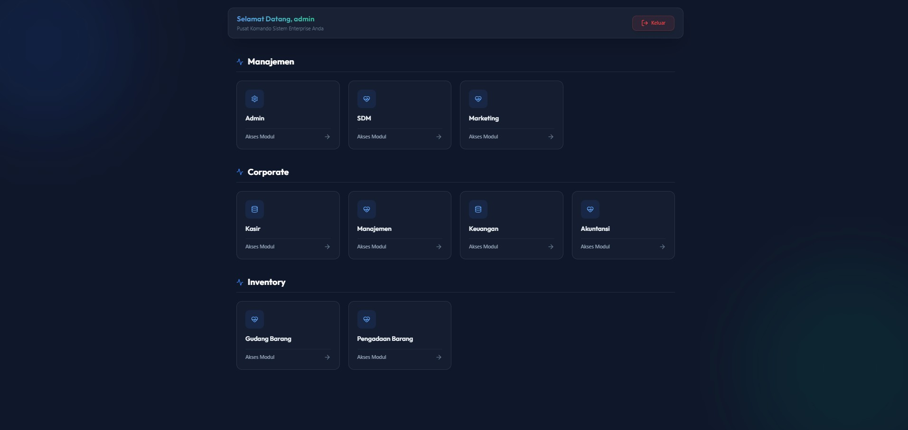
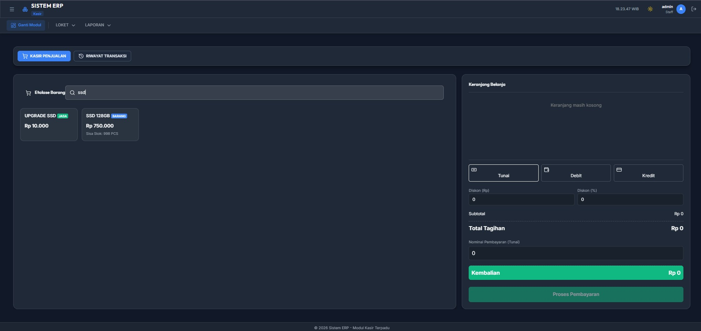
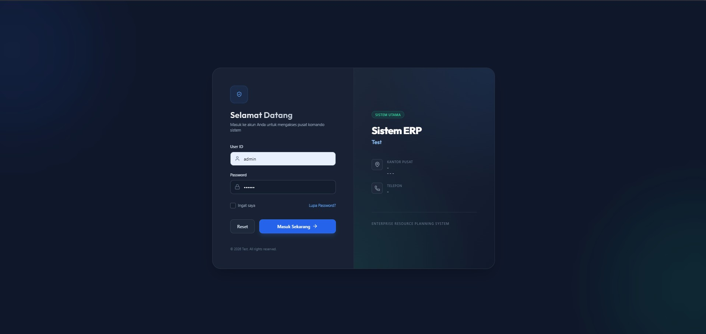
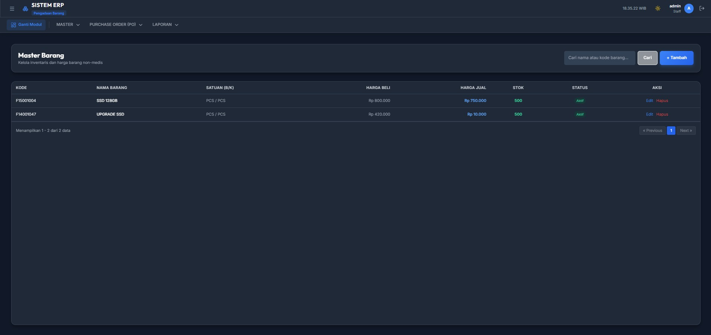

<h1 align="center">Sistem ERP — Enterprise Resource Planning</h1>

<p align="center">
  A modern Enterprise Resource Planning (ERP) System built with Laravel, React, and Inertia.js,
  bridging legacy database structures with a contemporary Single Page Application experience.
</p>

<p align="center">
  
  
  
  
  
  
</p>

---

## 📋 Table of Contents

- [Overview](#overview)
- [Tech Stack](#tech-stack)
- [Features](#features)
- [Architecture](#architecture)
- [Getting Started](#getting-started)
- [Development Commands](#development-commands)
- [Project Structure](#project-structure)
- [Authentication & Authorization](#authentication--authorization)
- [Testing & CI](#testing--ci)
- [Deployment](#deployment)
- [Contributing](#contributing)
- [License](#license)

---

## 📖 Overview

**Sistem ERP (Enterprise Resource Planning)** is a comprehensive application that modernizes and extends legacy business management platforms. It provides a unified interface for client management, departmental operations, inventory control, point of sales (POS), reporting, and financial/accounting operations.

The application serves as a bridge between established legacy database structures (Microsoft SQL Server) and a modern **Single Page Application (SPA)** frontend, ensuring a smooth transition from the legacy system without disrupting existing operations.

### 📸 Screenshots
<details open>
  <summary>Click to view application interfaces</summary>
  <br/>
  
  **1. Dashboard & Module Navigation**
  

  **2. Point of Sales (Kasir) - Split View**
  

  **3. Secure Login Screen**
  

  **4. Master Data Inventory (Full-Width List View)**
  
</details>

---

## 🛠️ Tech Stack

| Layer | Technology | Version |
|-------|-----------|---------|
| **Backend Framework** | [Laravel](https://laravel.com/) | ^12.0 |
| **Language** | PHP | ^8.2 |
| **Frontend Framework** | [React](https://react.dev/) | ^18.3 |
| **Frontend Bridge** | [Inertia.js](https://inertiajs.com/) | ^1.0 (React), ^2.0 (Laravel) |
| **Bundler** | [Vite](https://vitejs.dev/) | ^4.0 |
| **Database** | Microsoft SQL Server (`sqlsrv`) | — |
| **Icons** | [Lucide React](https://lucide.dev/) | ^1.17 |
| **HTTP Client** | Axios | ^1.1 |
| **API Auth** | Laravel Sanctum | ^4.0 |
| **Testing** | PHPUnit | ^11.0 |
| **Static Analysis** | Larastan | ^3.0 (Level 5) |
| **Code Style** | Laravel Pint | ^1.0 |
| **JS Linting** | ESLint | ^9.0 |

---

## ✨ Features

### 🏢 Customer & Client Management (CRM)
- **New Client Registration** — Auto-generated unique IDs with zero-padded format.
- **Client Lookup** — Search and select previously registered corporate or retail clients.
- **Client History** — Comprehensive tracking of client transactions and interaction history.

### 💼 Departmental Operations
- **Department Requests** — Manage operational requests and queues across various divisions.
- **Service Listings** — Real-time overview of active services being rendered.
- **After-Hours Operations** — Support for shift-based and 24/7 continuous business operations.

### 📦 Inventory & Point of Sales (POS)
- **Retail Point of Sales** — A high-performance, split-view POS system for fast checkout operations.
- **Live Search & Auto-Pagination** — Debounce-enabled inventory lookup to handle millions of items smoothly without memory exhaustion.
- **Returns & Refunds** — Robust logic for partial product returns and immediate stock reconciliation.
- **Receipt Printing** — Thermal printer integration for transaction receipts.

### 📊 Master Data & Pricing
- **Service Tariffs & Pricing** — Centralized management of service prices, including bundled packages.
- **Asset/Room Information** — Monitor availability and occupancy of corporate assets, meeting rooms, or rental units.
- **Staff Scheduling** — View and manage employee and specialist availability across departments.

### 🤖 AI-Powered Assistants
- **Agnostic AI Integration** — Switchable AI providers (Google Gemini / Local Ollama) via `.env` configuration.
- **Smart Recommendations** — Context-aware AI suggestions during checkout or data entry.
- **Fuzzy Search Resiliency** — AI data sanitization and regex-based fuzzy search to prevent errors from typos or markdown formatting.

### 📅 Appointments & Bookings
- **Booking Management** — Schedule and track client appointments and reservations.
- **Online Integrations** — Support for verifying bookings originating from third-party or online channels.

### 📈 Advanced Reporting
- **High-Performance Dashboards** — Lightning-fast analytics powered by multi-result-set SQL Stored Procedures.
- **Custom Filters** — Filter reports by date, shift, and user without freezing the UI.
- **Export Capabilities** — Export transactional data to Excel/CSV.

### 🔄 Legacy System Integration
- **Legacy Module Viewer** — Safely embed older PHP modules via iframe while preserving the SPA experience.
- **External API Integrations** — Connect to third-party APIs and government services effortlessly.

---

## 🏗️ Architecture

### Data Flow & SPA Hybrid Pattern

```
Browser Request → Laravel Route → Controller → Inertia::render('PageName', $data)
    → React component renders with props → User interacts → Inertia navigates (no full reload)
```

The application uses **Inertia.js** as the primary glue between Laravel and React. Instead of returning Blade views or building a separate massive JSON API, controllers return `Inertia::render()` calls that map directly to React page components. 

For high-speed, asynchronous features (like AI Assistants or Live Debounce Search), the system bypasses Inertia and utilizes lightweight **Fetch API** or **Axios** to communicate directly with isolated REST API endpoints, forming a true **Hybrid SPA** architecture.

### Key Patterns

- **Shared Data**: The `HandleInertiaRequests` middleware injects auth user data, flash messages, and top navigation menu structure into every Inertia page response.
- **Structured Layouts**: The UI strictly separates "Form Views" (Document Sheet + History Panel) and "List Views" (Full-width data grids) to maximize screen real estate.
- **High-Performance Analytics**: Dashboards rely on multi-result-set SQL Stored Procedures rather than Eloquent ORM to process massive datasets in milliseconds before sending them to React charts.

### Idempotent Migrations

All **4,315+ migration files** are designed to be safe for re-running against an existing legacy database. They extensively use:

- `Schema::hasTable()` guards before `Schema::create()`
- `CREATE OR ALTER VIEW` / `CREATE OR ALTER PROCEDURE` for views and stored procedures
- `sys.foreign_keys` existence checks for foreign key constraints

---

## 🚀 Getting Started

### Prerequisites

- PHP ^8.2 with `pdo_sqlsrv` extension
- [Microsoft ODBC Driver for SQL Server](https://learn.microsoft.com/en-us/sql/connect/php/installation-tutorial-linux-mac)
- Composer
- Node.js & npm
- SQL Server instance

### Installation

```bash
# 1. Clone the repository
git clone <repository-url>
cd aplikasi_erp_laravel

# 2. Install PHP dependencies
composer install

# 3. Install Node.js dependencies
npm install

# 4. Environment setup
cp .env.example .env
php artisan key:generate
```

### Environment Configuration

Edit `.env` with your SQL Server credentials:

```env
DB_CONNECTION=sqlsrv
DB_HOST=localhost
DB_PORT=1433
DB_DATABASE=aplikasi_erp_db
DB_USERNAME=sa
DB_PASSWORD=your_password
DB_ENCRYPT=yes
DB_TRUST_SERVER_CERTIFICATE=true   # set false in production with a valid cert
```

### Running the Application

```bash
# Terminal 1: Laravel dev server
php artisan serve

# Terminal 2: Vite hot-reload
npm run dev
```

Visit `http://localhost:8000` — you'll be redirected to the login page.

---

## 💻 Development Commands

### Laravel / PHP

```bash
php artisan serve                  # Start dev server
php artisan migrate                # Run migrations
php artisan migrate:rollback       # Rollback last migration batch
php artisan tinker                 # Interactive REPL
php artisan route:list              # List all registered routes
php artisan cache:clear && php artisan config:clear && php artisan view:clear
```

### Frontend (Vite + React)

```bash
npm run dev      # Start Vite dev server with hot module replacement
npm run build    # Production build
npm run lint     # Run ESLint on resources/js
```

### Testing

```bash
php artisan test                           # Run all tests (SQLite in-memory)
./vendor/bin/phpunit tests/Unit/ExampleTest.php  # Run specific file
```

### Code Quality

```bash
./vendor/bin/pint         # Auto-fix PHP code style (Laravel Pint)
./vendor/bin/pint --test  # Check PHP code style without changes
./vendor/bin/phpstan analyse --memory-limit=2G  # Static analysis (Level 5)
```

---

## 📁 Project Structure

```
├── app/
│   ├── Console/                  # Artisan commands
│   ├── Exceptions/               # Error handlers
│   ├── Helpers/                  # Legacy DB helpers (global scope)
│   ├── Http/
│   │   ├── Controllers/          # Request handlers
│   │   │   ├── Registrasi/       # Registration sub-controllers
│   │   │   ├── AuthController.php
│   │   │   ├── DashboardController.php
│   │   │   ├── ...               # 15+ feature controllers
│   │   │   └── LegacyController.php
│   │   └── Middleware/           # Auth, permissions, Inertia setup
│   ├── Models/                   # Eloquent models
│   └── Providers/                # Service providers
├── bootstrap/
├── config/                       # Application configuration (15 files)
├── database/
│   ├── migrations/               # 4,315+ migrations (legacy schema)
│   ├── factories/
│   └── seeders/
├── deploy/                       # Docker deployment configurations
│   ├── production/               # Planned, not yet implemented
│   └── staging/                  # Laravel Octane + FrankenPHP setup
├── resources/
│   ├── css/                      # Application stylesheets
│   ├── js/
│   │   ├── Layouts/              # Shared React layouts
│   │   │   └── DashboardLayout.jsx
│   │   ├── Pages/                # React page components (30+)
│   │   │   ├── Auth/
│   │   │   ├── Registrasi/       # 25 registration pages
│   │   │   ├── Laporan/
│   │   │   ├── Poli/
│   │   │   └── ...
│   │   ├── app.js                # Inertia app bootstrap
│   │   └── bootstrap.js
│   └── views/                    # Blade templates
│       ├── app.blade.php         # Root Inertia template
│       ├── auth/
│       └── laporan/
├── routes/
│   ├── web.php                   # All web routes
│   ├── api.php                   # Sanctum-protected API routes
│   ├── channels.php              # Broadcast channels
│   └── console.php               # Artisan command routes
├── tests/                        # PHPUnit test suites
├── .docs/                        # Internal documentation
│   └── eng-init/                 # Engineering improvement plans
├── .github/workflows/            # CI pipeline
├── CLAUDE.md                     # AI agent project guide
├── AGENTS.md                     # Agent instructions
├── composer.json
├── package.json
├── vite.config.js
└── phpunit.xml
```

---

## 🔐 Authentication & Authorization

### Authentication

The application uses a **custom session-based authentication** system against the legacy `dd_user` table:

1. User submits credentials to `POST /login`
2. Password is verified using MD5 hashing with case-sensitive SQL collation (`Latin1_General_CS_AS`)
3. On success, user session data is stored and login is logged to `log_user_login` / `log_user_login_detail`
4. Users are redirected to the module selection screen (or directly to their assigned module)

### Authorization

Access control is handled by the `CheckPermission` middleware (aliased as `check.permission` in `Kernel.php`), which:

- Queries the `admin_hak_user_v` database view
- Validates user access at the module, menu, and sub-menu levels
- Redirects unauthorized users appropriately

---

## 🧪 Testing & CI

### Test Environment

Tests use an in-memory SQLite database (`DB_CONNECTION=array`), requiring no real database connection.

### Continuous Integration

The project uses **GitHub Actions** (`.github/workflows/ci.yml`) with three parallel jobs triggered on PRs and pushes to `main`:

| Job | Tool | Scope |
|-----|------|-------|
| **PHP Static Analysis** | Laravel Pint + Larastan (Level 5) | `app/`, `routes/`, `tests/`, `config/` |
| **JavaScript Lint** | ESLint | `resources/js/` |
| **PHP Tests** | PHPUnit | Full test suite |

---

## 🐳 Deployment

Docker-based deployment configurations are available in the `deploy/` directory:

- **[Staging](deploy/staging/README.md)** — Laravel Octane + FrankenPHP with external SQL Server (ready to use)
- **Production** — Planned, not yet implemented

Each environment uses a multi-stage Dockerfile with the project root as the build context.

---

## 🤝 Contributing

Please read [CLAUDE.md](CLAUDE.md) and [AGENTS.md](AGENTS.md) for project conventions and development workflow guidelines.

### Development Workflow

1. Run `./vendor/bin/pint --test` to check PHP code style
2. Run `./vendor/bin/phpstan analyse --memory-limit=2G` for static analysis
3. Run `php artisan test` to verify all tests pass

All three checks **must** pass cleanly before changes are considered complete.

---

## 📄 License

Copyright (c) 2026 LisanSidqi (Lisan-20). **All Rights Reserved.**

This repository is provided strictly for **portfolio, educational, and demonstration purposes**. 
You may view the source code, but you are **not permitted** to use, copy, reproduce, modify, distribute, or sell any part of this software without explicit written permission from the author.
